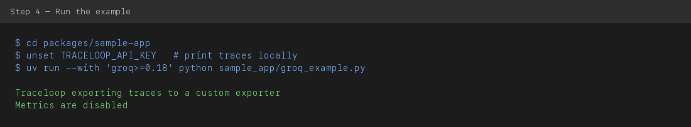
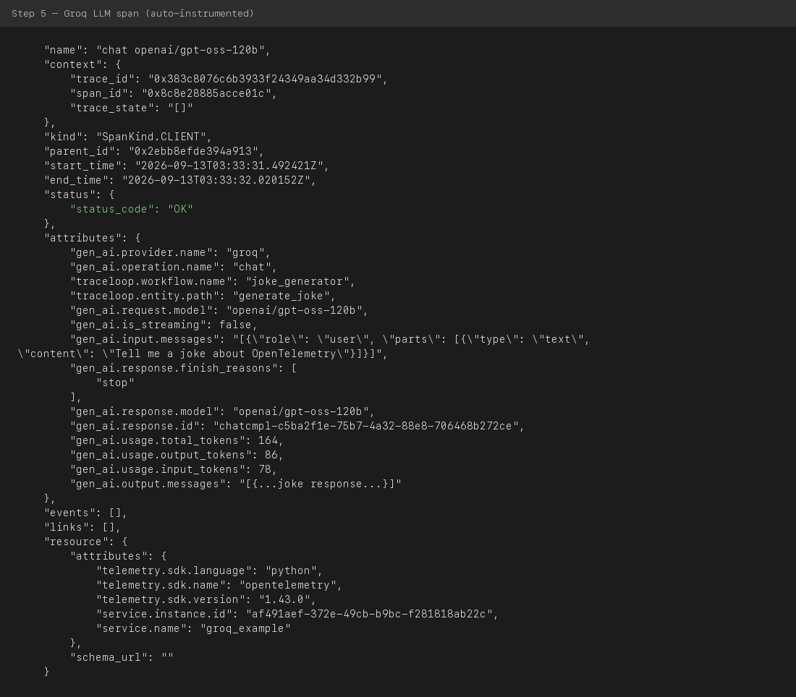
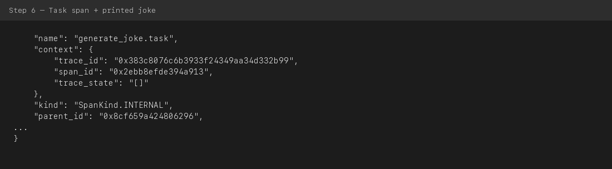
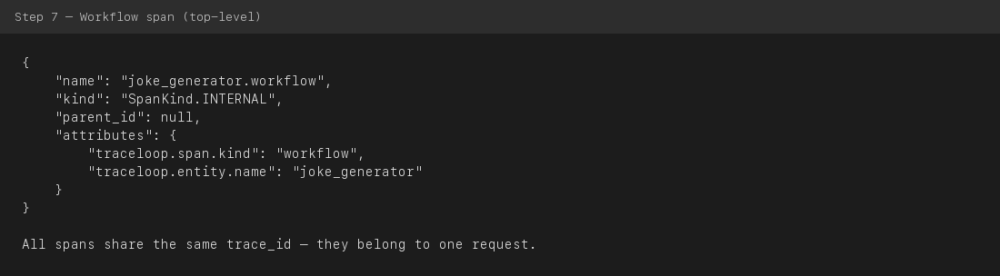

# Sample App — Groq Getting Started Guide

Runnable examples for tracing LLM applications with [OpenLLMetry](https://github.com/traceloop/openllmetry).

This guide walks you through **`groq_example.py`** step by step. Groq is a great first example because it has a **free API tier** and returns responses quickly.

---

## What you'll learn

By the end of this guide you will:

1. Set up the sample app locally
2. Run a Groq LLM call with OpenLLMetry tracing enabled
3. Read the trace output in your terminal
4. Understand how **workflow**, **task**, and **LLM** spans relate to each other

---

## Prerequisites

Before you start, make sure you have:

| Requirement | Why |
|-------------|-----|
| Python 3.10–3.12 | See `.python-version` in this folder |
| [Node.js](https://nodejs.org/) | Runs monorepo commands (`nx`) |
| [uv](https://docs.astral.sh/uv/) | Python package manager used by this repo |
| [Groq API key](https://console.groq.com/keys) | Free tier available — used to call the LLM |

> **No Traceloop cloud account required.** This example prints traces directly to your terminal.

---

## Step 1 — Clone and install dependencies

From the **repository root**:

```bash
git clone https://github.com/traceloop/openllmetry.git
cd openllmetry
npm ci
npx nx run sample-app:install
```

**What this does:**
- `npm ci` installs JavaScript tooling for the monorepo
- `npx nx run sample-app:install` creates a Python virtual environment and installs all sample-app dependencies (including `traceloop-sdk` and Groq instrumentation)

---

## Step 2 — Get a Groq API key

1. Go to [console.groq.com](https://console.groq.com/)
2. Sign up (free tier is fine)
3. Open **API Keys** → **Create API Key**
4. Copy the key — it starts with `gsk_`

---

## Step 3 — Configure your environment

```bash
cd packages/sample-app
cp .env.example .env
```

Edit `.env` and set your Groq key (**no space** after `=`):

```bash
GROQ_API_KEY=gsk-your-key-here
```

Load the variables into your terminal:

```bash
set -a
source .env
set +a
```

Verify the key is set (does not print the key itself):

```bash
echo "GROQ_API_KEY set: ${GROQ_API_KEY:+yes}"
```

For local terminal tracing, **do not set** `TRACELOOP_API_KEY` (or comment it out in `.env`):

```bash
unset TRACELOOP_API_KEY
```

---

## Step 4 — Run the example

```bash
cd packages/sample-app
uv run --with 'groq>=0.18' python sample_app/groq_example.py
```

> The `--with 'groq>=0.18'` flag avoids a known `groq`/`httpx` version mismatch in some environments.

You should see tracing initialize, then JSON spans, then a joke:



---

## Step 5 — Read the Groq LLM span

OpenLLMetry automatically instruments the Groq API call. Look for a span named `chat openai/gpt-oss-120b` with `"status_code": "OK"`:



**Key fields to notice:**

| Field | Meaning |
|-------|---------|
| `"gen_ai.provider.name": "groq"` | Which LLM provider was called |
| `"gen_ai.request.model"` | Model used for the request |
| `"gen_ai.usage.total_tokens"` | Tokens consumed (input + output) |
| `"status_code": "OK"` | The Groq call succeeded |

---

## Step 6 — Read the task span and joke output

The `@task` decorator wraps `generate_joke()`. Its span captures the function input/output:



The plain-text joke printed between spans is the actual Groq response.

---

## Step 7 — Read the workflow span

The `@workflow` decorator wraps `joke_generator()` — the top-level entry point:



All spans share the same `trace_id`, which ties them together as one traced request.

---

## Trace hierarchy (big picture)

```text
joke_generator.workflow          ← @workflow (top level)
└── generate_joke.task           ← @task (your function)
    └── chat openai/gpt-oss-120b   ← auto-instrumented Groq API call
```

---

## How the code works

```python
from traceloop.sdk import Traceloop
from traceloop.sdk.decorators import task, workflow

Traceloop.init(app_name="groq_example", disable_batch=True)

@task(name="generate_joke")
def generate_joke():
    # Groq call is traced automatically
    ...

@workflow(name="joke_generator")
def joke_generator():
    generate_joke()
```

See the full script: [`sample_app/groq_example.py`](./sample_app/groq_example.py)

**Design choices in this example:**

- **`ConsoleSpanExporter`** — prints traces to your terminal when `TRACELOOP_API_KEY` is not set (no cloud account needed)
- **`disable_batch=True`** — shows spans immediately instead of batching them
- **`@workflow` / `@task`** — groups your code into readable trace hierarchy

---

## Exporting traces to the cloud (optional)

To send traces to [Traceloop Cloud](https://app.traceloop.com) instead of the terminal, add to `.env`:

```bash
TRACELOOP_API_KEY=your-valid-traceloop-api-key
```

See the [getting started guide](https://traceloop.com/docs/openllmetry/getting-started-python) for Datadog, Grafana, and other backends.

---

## Troubleshooting

| Problem | Fix |
|---------|-----|
| `Missing Traceloop API key` | Safe to ignore if traces print to terminal; or unset `TRACELOOP_API_KEY` |
| `401 Unauthorized` from Traceloop | Invalid `TRACELOOP_API_KEY` — comment it out for local tracing |
| `GROQ_API_KEY` not set / `Bearer ` error | Check `.env` has no space after `=`; run `source .env` |
| Model not found (404) | Check [Groq models](https://console.groq.com/docs/models) and update `MODEL` in `groq_example.py` |
| `proxies` TypeError | Run with `uv run --with 'groq>=0.18' python sample_app/groq_example.py` |
| Watsonx warning | Harmless — optional dependency not installed |

---

## More examples

Browse [`sample_app/`](./sample_app/) for other providers and frameworks:

| Category | Examples |
|----------|----------|
| LLM providers | `openai_streaming.py`, `anthropic_joke_example.py`, `cohere_example.py` |
| Local models | `ollama_streaming.py` |
| Frameworks | `langchain_app.py`, `langgraph_example.py`, `crewai_example.py` |
| Vector DBs | `chroma_app.py`, `pinecone_app.py`, `qdrant_app.py` |

---

## Development commands

From the repository root:

```bash
npx nx run sample-app:lint
npx nx run sample-app:test
```

---

## Contributing

- [Contributing guide](https://traceloop.com/docs/openllmetry/contributing/overview)
- [Slack community](https://traceloop.com/slack)
